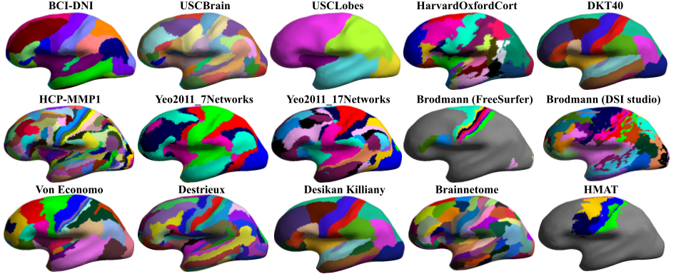

# svreg_multiparc
This module generates multiple parcellations of a single subject that has been processed by BrainSuite and SVReg. The figure below shows multiple parcellations of a single subject shown on a smooth representation of the cortex.

## System requirements: 
Same as in BrainSuite system requirements. Make sure that you have BrainSuite installed and running on your platform.

## Usage
To run the svreg_multiparc module, 
1. First download the USCBrainMulti atlas [here](https://drive.google.com/file/d/1YpQH8rQA0v2lNFXR-XdWPIfmleO_095-/view?usp=sharing), and unzip it.
2. Download the binaries for svreg_multiparc [here](https://github.com/ajoshiusc/svreg_multiparc/releases).
3. Process your T1 MRI using BrainSuite and SVReg sequence. Please make sure to use BCI-DNI or USCBrain brain atlas. 
4. Run the command. Usage is: ``svreg_multiparc.sh [subjectbase] [multiatlas dir] [BainSuitePath] [AtlasName]``
where 
subbasename: this is as in BrainSuite processed MRI. If the input t1 was path/inmri.nii.gz then subbasename is path/inmri.nii.gz
multiatlas_dir: directory path where multi atlas was unzipped in step 1.
BraiSuitePath: Path of BrainSuite installation
AtlasName: 'all' for all atlases, or specify the one atlas that you want to use. Example usage is as follows:

    ``./svreg_multiparc.sh /path/subjectmriname /path/USCBrainMulti /path/BrainSuite19b DKT40``

Here are screenshots of smoothed representation of labelled subject cortex for one subject.

## Visualize the labels in BrainSuite
You can visualize the generated parcellations in brainsuite.
1. first open the original mri in brainstorm.
2. open the multiparc subfolder in the subject folder that has been generated by svreg_multiparc
3. File->Open->Label file and load the label.nii.gz files from the multiparc subdirectory.
4. drag and drop the two dfs files into brainsuite interface.
5. Load the label description by Tools->Painter tools-> Load Description. Select brainsuite_labeldescrition.<atlas>.xml

You will see the gui as below. You can click on surface or volume and see the label at the bottom left of the GUI.

## Comparison
A quantitaive comparison and validation still needs to be performed. Here is one result

